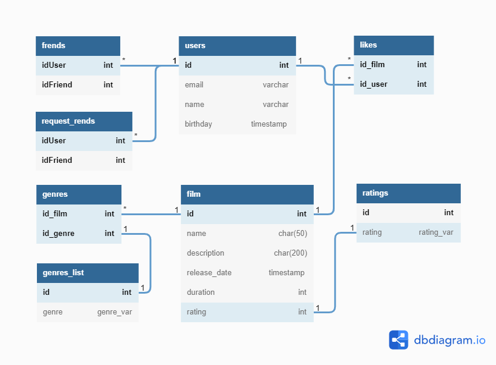

# java-filmorate
___
##Вводная часть
В проекте __filmorate__ выполняется работа с фильмами и оценками пользователей.
Возвращение топ фильмов, рекомендованных к просмотру

>Данный проект написан на языке Java SE 11 в рамках учебного курса 
> на платформе Yandex.Practicum
> 
>В проекте используются такие технологие как:
>- Spring Boot
>- Maven
>
>Прочие зависимости:
>- lombok
>- logbook
>- junit
___
##Database relationship diagram



###Локальные типы данных
- Список жанров
```
Enum genre_var {
  COMEDY -- комедия
  DRAMA -- драма
  CARTOON -- мультфильм
  THRILLER -- триллер
  DOCUMENTARY -- документальный
  ACTION -- боевик
}
```
- Список рейтингов по системе рейтинга Ассоциаций кинокомпаний (англ. Motion Picture Association, сокращённо МРА)
```
Enum rating_var {
  G -- у фильма нет возрастных ограничений
  PG -- детям рекомендуется смотреть фильм с родителями
  PG13 -- детям до 13 лет просмотр не желателен
  R -- лицам до 17 лет просматривать фильм можно только в присутствии взрослого,
  NC17 -- лицам до 18 лет просмотр запрещён
}
```
##Примеры запросов
>Примеры написаны на базе СУБД PostgreSQL
- Вывести топ 10 фильмов
```
SELECT
    f.name AS название_фильма,
    l.count_likes AS количество_лайков
FROM film f
LEFT JOIN (SELECT id_film,
                  COUNT(id_film) count_likes
          FROM likes
          GROUP BY id_film) l
ON f.id = l.id_film
ORDER BY 2 DESC
LIMIT 10
```
> Результат запроса может выглядить так:

| название_фильма | количество_лайков | 
|-----------------|-------------------|
| name5           | 17                |
| name2           | 15                |
| name1           | 9                 |

- Вывести информацию о фильмах
```
SELECT
    f.id,
    name,
    description,
    release_date,
    duration, 
    gl.genre, --при условии, что один фильм соответствует одному жанру
    r.rating
FROM film f
JOIN geners g ON f.id = g.id_film
JOIN geners_list gl ON g.id_genre = gl.id
JOIN ratings r ON f.rating = r.rating
```
> Результат запроса может выглядить так:

| id  | name  | description           | release_date | duration | genre  | rating | 
|-----|-------|-----------------------|--------------|----------|--------|--------|
| 1   | name1 | Some words about film<br/> | 2022-12-10   | 132      | COMEDY | 65     |

